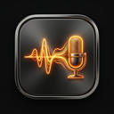

<div align="center">
  
  <h1>MicMorph</h1>
  <p><strong>Real-time voice pitch tuning for macOS. Sound deeper, bolder, and more confident on every call.</strong></p>

  <p>
    <a href="#features">Features</a> •
    <a href="#how-it-works">How It Works</a> •
    <a href="#installation">Installation</a> •
    <a href="#build-from-source">Build from Source</a> •
    <a href="#privacy--security">Privacy</a> •
    <a href="#legal--disclaimers">Legal</a>
  </p>

  <p>
    
    
    
    
    
  </p>
</div>

---

## 🎙️ Overview

**MicMorph** is a lightweight, zero-latency macOS utility that transforms your microphone voice in real time during live calls. Whether you are presenting in **Google Meet**, hosting in **Zoom**, chatting in **Slack Huddles**, or streaming via **OBS**, MicMorph processes your voice directly on your device with natural acoustic preservation.

---

## ✨ Features

- **⚡ Zero-Latency Real-Time DSP**: Pitch shifting powered by **SoundTouch DSP** and native macOS **CoreAudio** threads.
- **🎛️ 5 Instant Voice Presets**:
  - `Subtle (-1 st)` — Gentle richness and presence
  - `Medium (-3 st)` — Authoritative, balanced pitch
  - `Deep (-5 st)` — Warm, resonant broadcast tone
  - `Deepest (-8 st)` — Deep acoustic voice
  - `Natural (0 st)` — Clean bypass mode
- **🎧 Live Voice Preview**: Listen to your pitch-shifted voice in real time through your headphones before joining calls.
- **📌 Native macOS Menu Bar Tray**: Switch voice presets with 1 click directly from your menu bar without opening the main window.
- **🔒 100% On-Device Privacy**: No servers, no cloud APIs, no audio recording. Your voice never leaves your Mac.
- **🪶 Ultra Lightweight**: ~2.3 MB package size, <2% CPU utilization.

---

## 🛠️ How It Works

```
Real Microphone ──▶ [ MicMorph Audio Engine ] ──▶ [ BlackHole 2ch Driver ] ──▶ Google Meet / Zoom / Slack
                       (SoundTouch DSP)                (Virtual Mic)
```

1. **Capture**: MicMorph reads incoming audio frames from your physical microphone via CPAL.
2. **Transform**: Processes the audio buffers in real time using SoundTouch pitch transposition algorithms.
3. **Route**: Feeds the pitch-shifted audio into the **BlackHole 2ch** virtual audio bridge.
4. **Broadcast**: Any calling application selecting **MicMorph / BlackHole** as its microphone input receives the transformed voice automatically.

---

## 📥 Installation

### 1. Download the App
Download the latest `.dmg` installer from the [Releases](https://github.com/abhinav-kumar-singh/micmorph/releases) page or the official landing page:
* Drag **MicMorph.app** into your `/Applications` folder.

### 2. Install BlackHole Virtual Audio Driver
MicMorph uses BlackHole to create the virtual microphone bridge. Install it via Homebrew:
```bash
brew install blackhole-2ch
```
*(Restart your Mac after installing BlackHole to register the virtual audio driver).*

### 3. Select in Calls
In **Google Meet**, **Zoom**, **Slack**, or **Discord**, open Audio Settings and choose **"BlackHole 2ch"** (or your aggregate device) as your Microphone.

---

## 💻 Build from Source

### Prerequisites
- **macOS** 10.15 (Catalina) or later
- **Rust** (latest stable toolchain): `curl --proto '=https' --tlsv1.2 -sSf https://sh.rustup.rs | sh`
- **Node.js** 18+ and `npm`
- **SoundTouch library**: `brew install sound-touch`

### Clone & Run Development Server
```bash
git clone https://github.com/abhinav-kumar-singh/micmorph.git
cd micmorph

# Install dependencies
npm install

# Start development app (with hot reload)
npm run dev
```

### Build Production DMG Bundle
```bash
# Build optimized release binary and DMG installer
npm run build
```
The compiled installer will be generated at:
`src-tauri/target/release/bundle/dmg/MicMorph_0.1.0_aarch64.dmg`

---

## 🔒 Privacy & Security

- **No Remote Streaming**: All audio processing occurs purely in RAM on your local CPU.
- **No Data Retention**: MicMorph does not write voice audio to disk or transmit telemetry.
- **Local Settings**: User preferences (selected device, preset, daily usage timer) are stored locally in `~/Library/Application Support/com.micmorph.desktop/config.json`.

---

## ⚖️ Legal & Trademark Disclaimers

- **Third-Party Trademarks**: Google Meet, Zoom, Slack, Microsoft Teams, Discord, and OBS Studio are registered trademarks of their respective owners (Google LLC, Zoom Video Communications, Salesforce, Microsoft Corporation, Discord Inc., and the OBS Project). MicMorph is an independent software utility and is **not affiliated with, sponsored by, or endorsed by** these organizations.
- **Open-Source Attributions**:
  - [BlackHole](https://github.com/ExistentialAudio/BlackHole) is created by Existential Audio Inc., licensed under GPLv3.
  - [SoundTouch](https://www.surina.net/soundtouch/) audio processing library is created by Olli Parviainen, licensed under LGPL v2.1.
- **Acceptable Use**: Users are responsible for complying with all applicable recording and wiretapping consent laws in their jurisdiction.

---

## 📄 License

This project is licensed under the [MIT License](LICENSE).
